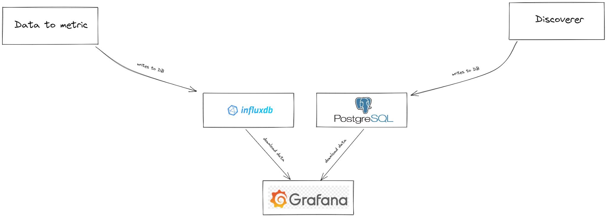
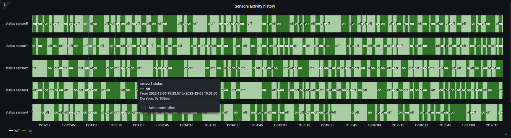
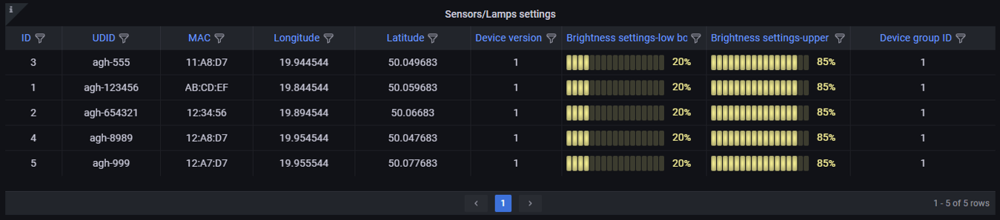
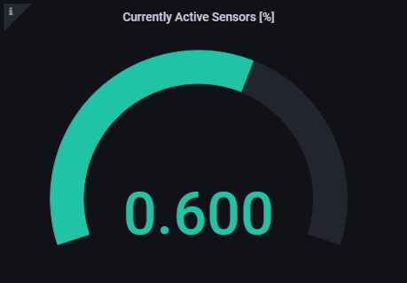
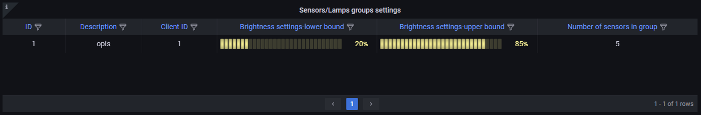
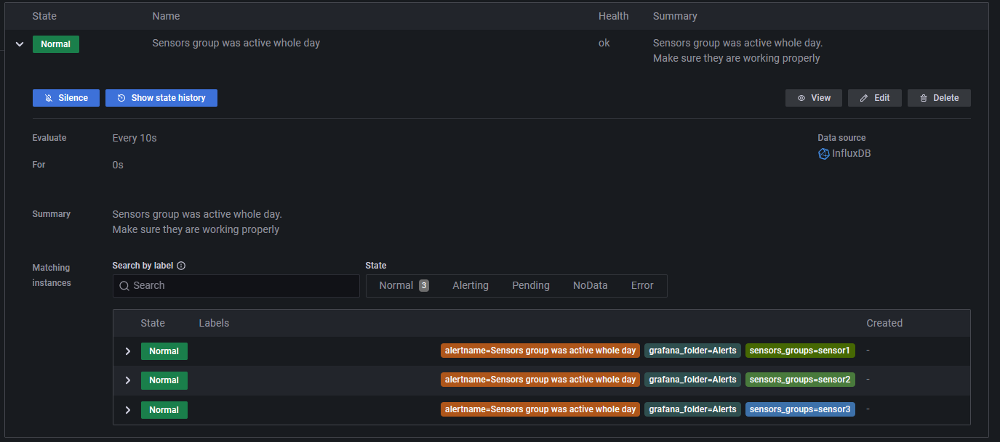
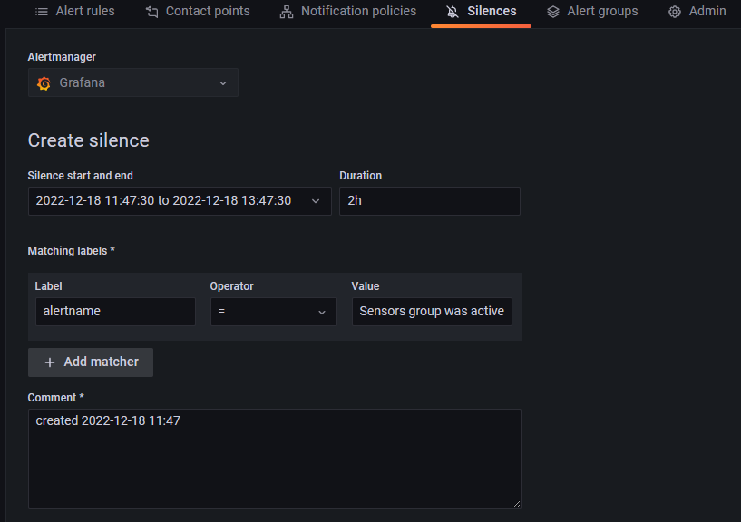
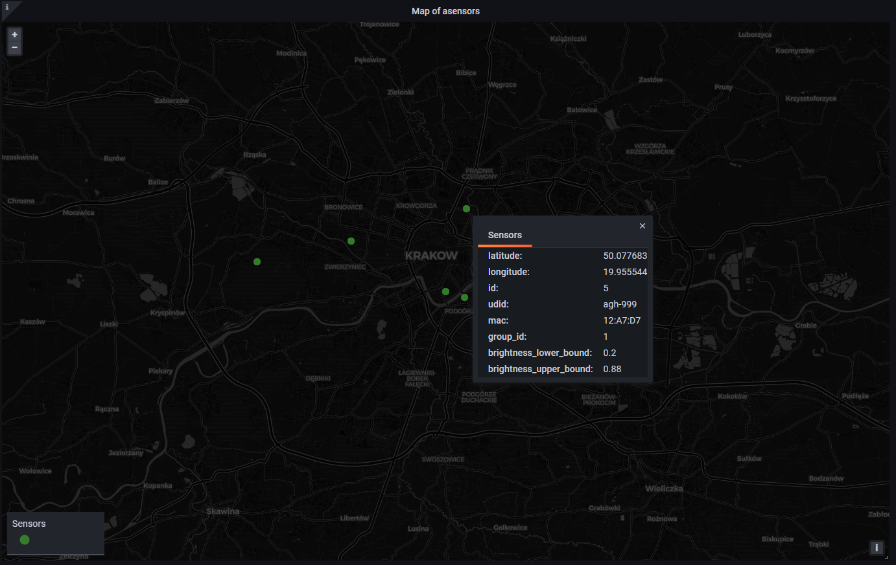
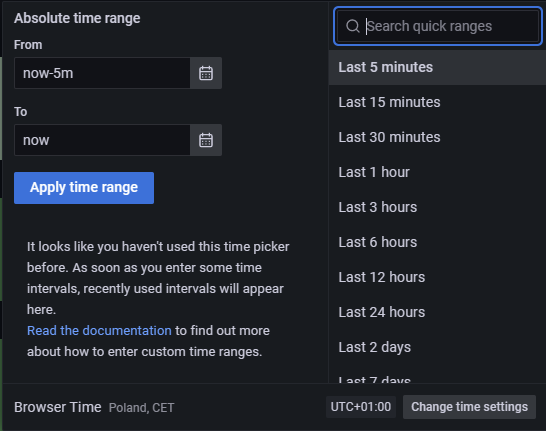
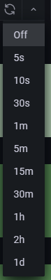

# Grafana
Do wizualizacji informacji odnośnie stanu sieci rozważano kilka najpopularniejszych rozwiązań m.in:

- Power BI - w przypadku którego problemem okazało się odświeżanie danych zaledwie raz dziennie oraz brak wsparcia
dla wszystkich źródeł danych  używanych w systemie.

- Kibana - która pomimo posiadania wielu zalet wymagałaby uruchomienia w systemie instancji Elasticsearch oraz nie posiada
wbudowanego mechanizmu generowania alertów, co wiązałoby się z konieczności instalacji dodatkowych narzędzi w systemie.

Dlatego też ostatecznie do wizualizacji wykorzystaliśmy narzędzie o nazwie Grafana. Posiada ona wsparcie dla wymaganych źródeł danych,
wbudowany system generowania alertów i jest udostępniana na licencji umożliwiającej użycie jej w naszym projekcie bez ponoszenia dodatkowych
opłat ([Grafana licence](https://github.com/grafana/grafana/blob/main/LICENSE))

Stworzona tablica (dashboard) pozwala użytkownikowi sprawdzić podstawowe parametry działania sieci. Posiada ona integrację  zarówno z 
bazą danych InfluxDB, zawierającą informację o dokonanych pomiarach, jak i Postgress, z informacją
o urządzeniach w sieci i ich konfiguracji. Jest ona dostępny pod adresem:

[IoT Dashboard Grafana](http://139.144.44.134:3000/d/5HUMlnH4z/iot-dashboard?orgId=1) 

lub bezpośrednio z poziomu aplikacji pozwalającej na modyfikowanie ustawień lamp.

Uproszczona architektura części systemu odpowiedzialnego za wizualizację

## Skład przygotowanej tablicy:

### Historia aktywności sensorów
Wykres ten zawiera informacje o stanach sensorów (a tym samym lamp) w ciągu ostatnich 7 dni. Na osi x oznaczony został czas, natomiast
oś y zawiera poszczególne grupy sensorów. Po wybraniu konkretnego fragmentu wykresu wyświetlana jest szczegółowa informacja na temat czasu,
przez jaki grupa sensorów znajdywała się w danym stanie (zarówno sumaryczny czas, jak i dokładna data początku i końca danego stanu). Istnieje 
możliwość dodania adnotacji do konkretnego fragmentu wykresu.

Zapytanie w języku Flux pobierające odpowiednie dane z bazy InfluxDB:
```flux
from(bucket: "IoT")
|> range(start: -7d, stop: now())
|> filter(fn: (r) => r["_measurement"] =~ /sensor*/ and r._field == "is_active")
|> set(key: "_field", value: "status")
```

Widok historii stanów poszczególnych grup sensorów:



### Ustawienia sensorów/lamp
Tabela zawiera informacje na temat ustawień poszczególnych urządzeń w sieci. Pojedynczy wiersz zawiera:

- informacje na temat wartości jednoznacznie identyfikujących dane urządzenie, takich jak ID, UDID oraz adres MAC
- informacje odnoście lokalizacji danego urządzenia (longitude, latitude)
- numer wersji urządzenia
- ustawienia jasności lampy przypisanej do danego urządzenia - wartości do jakich dana lampa się rozjaśnia/przygasza (wraz z wizualną reprezentacją)
- identyfikatora grupy, do której należy dane urządzenie - Device group ID

Zapytanie w języku SQL pobierające odpowiednie dane z bazy Postgress:
```sql
SELECT
  devices.id,devices.UDID,devices.MAC,devices.longitude,devices.latitude,devices.version_id,groups.configuration -> 'lower_threshold' AS lower_bound, groups.configuration -> 'upper_threshold' AS upper_bound, devices.group_id 
FROM devices 
INNER JOIN groups ON groups.id=devices.group_id;
```
Widok tabeli z ustawieniami sensorów/lamp:


### Aktualnie aktywne sensory/zapalone latarnie
Miernik (gauge) zawierający informację o stosunku aktywnych urządzeń, do wszystkich urządzeń, jakie obecnie zainstalowane są w sieci, na przestrzeni ostatniej godziny.

Zapytanie w języku Flux pobierające odpowiednie dane z bazy InfluxDB:
```flux
from(bucket: "IoT")
|> range(start: -1h, stop: now())
|> filter(fn: (r) => r["_measurement"] == "sensors_stats" or r.field == "active_lanterns_ratio")
|> yield(name: "last")

```

Widok miernika z procentem aktywnych sensorów:


### Ustawienia grupy sensorów
Tabela zawiera informacje o konfiguracji grupy sensorów. Pojedynczy wiersz zawiera:

- ID - jednoznacznie identyfikujące grupę urządzeń
- Description - z opisem dotyczącym danej grupy
- Client ID - identyfikujące klienta, do którego należy dany grupa urządzeń
- ustawienia jasności lamp należących do danej grupy  - wartości, do jakich dana grupa lamp się rozjaśnia/przygasza (wraz z wizualną reprezentacją)
- liczba urządzeń w danej grupie

Zapytanie w języku SQL pobierające odpowiednie dane z bazy Postgress:
```sql
SELECT
  id, description, client_id, groups.configuration -> 'lower_threshold' AS lower_bound, groups.configuration -> 'upper_threshold' AS upper_bound, quantity
FROM groups;
```
Widok tabeli z ustawieniami grupy sensorów:


### Alarmy
Tabela zawiera informacje o alarmach ustawionych w sieci i ich stanach. Dla każdej grupy sensorów znajdującej się w sieci sprawdzamy jej aktywność w ciągu ostatnich 24h.
Jeśli sumaryczny czas świecenia lamp w ciągu ostatniej doby wyniósł 24h, to uznajemy, że urządzenie uległo awarii i generujemy
adekwatny alarm, który wyświetlany jest klientowi. Jeśli klient uzna, że takie zachowanie jest pożądane, to istnieje możliwość
zignorowania takiego alarmu.

Zapytanie w języku Flux pobierające odpowiednie dane z bazy InfluxDB:
```flux
from(bucket: "IoT")
|> range(start: -1d, stop: now())
|> filter(fn: (r) => r["_measurement"] =~ /sensor*/ and r._field == "is_active")	
|> rename(columns: {_measurement: "sensors_groups"})

```
Widok stanu alarmów dla wszystkich grup sensorów aktywnych w sieci:


Widok opcji ignorowania danego alarmu:


Widok ustawień ignorowania danego alarmu (możemy wybrać, że dany alarm jest ignorowany przez
określony czas, bo wiemy że np. w tym okresie prowadzone są na nim jakieś naprawy)


### Mapa
Mapa zawiera informacje o lokalizacji każdego sensora w sieci. Po wybraniu konkretnego sensora otrzymujemy informacje:

- o jego współrzędnych geograficznych,
- identyfikatorach urządzenia
- identyfikatora grupy urządzeń
- ustawieniach poziomów jasności lampy

Zapytanie w języku SQL pobierające odpowiednie dane z bazy Postgress:
```sql
SELECT
  devices.latitude, devices.longitude, devices.id,devices.UDID,devices.MAC, devices.group_id, groups.configuration -> 'lower_threshold' AS brightness_lower_bound, groups.configuration -> 'upper_threshold' AS brightness_upper_bound
FROM devices 
INNER JOIN groups ON groups.id=devices.group_id;

```
Widok mapy:


### Ustawienia całej tablicy:
Istnieje możliwość doboru okna czasowego z jakiego wyświetlane są dane na wszystkich wykresach oraz częstotliwości ich odświeżania.

Widok ustawień okna czasowego:



Widok ustawień częstotliwości odświeżania tablicy:                                 

