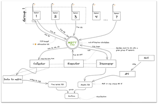

# Inteligentne oświetlenie miasta

## Założenia projektu

Celem projektu było stworzenie inteligentnego systemu, który umożliwi optymalizację zużycia energii elektrycznej w mieście. 
Rozwiązanie znacząco wpłynie na pobór energii elektrycznej przez system oświetlenia ulic miasta. 
Wyeliminowana zostanie nadmiarowość  naświetlania ulic, zmniejszając zanieczyszczanie światłem. 
Główną funkcjonalnością systemu jest wykrywanie ruchu pieszego, które będzie zintegrowane z oświetleniem miejskim. 

Poniżej znajduje się schemat architektury systemu. Całość składa się z 12 elementów logicznych:

- grup sensorów na latarniach zbierających informacje o ruchu 
- collector - moduł odpowiedzialny za zbieranie danych z sensorów
- executor - moduł wysyłającego informacje o konieczności zaświecenia wskazanych grup latarni
- discoverer - moduł zarządzający dostepnymi urządzeniami oraz ich ustawieniami
- data to metric - moduł odpowiedzialny za zapisywanie danych o funkcjonowaniu sieci do bazy danych
- time series DB - baza InfluxDB z informacjami odnosnie funkcjonowania sieci
- assets DB - baza Postgress zawierająca informacje o urządzeniach znajdujących się w sieci
- grafan - instancja narzędzia Grafana zawiejrająca wizualizację wszystkich danych zbieranych przez system
- api - REST API do komunikacji Assets DB - wyświetlanie i modyfikacja danych
- aplikacja webowa - aplikacja dostepna z poziomu przegladarki pozwalająca na sterowanie ustawieniami lamp
- discoverer - moduł obsługujący nowe urządzenia podłączane do systemu
- guardian - moduł zarządzający dostępem do brokera

